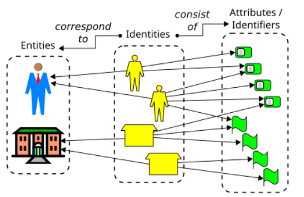

# Identity Management:

Identity management deals with the processes and policies involved in creating, maintaining, and removing digital identities. 
It focuses on managing user attributes, credentials, and the lifecycle of identities within an organization. 
The key components include user registration, credential management, identity lifecycle management (e.g., updates, deletions), and auditing identity-related activities.

1. The Pure Identity Function

The pure identity function focuses on the core aspects of managing digital identities throughout their lifecycle, independent of access or entitlement decisions. 
It involves the secure and organized handling of identity data from creation to deletion.

- Creation (Identity Registration): This is the process of establishing a new identity in the system. It involves collecting and verifying necessary information about a user, such as their name, email address, and other personal details. During this process, a unique identifier or user ID is typically assigned to the identity. User onboarding happens when a new digital identity is created, setting up the identity within the system.
- Management (Identity Maintenance): This involves updating and maintaining identity information over time to ensure it remains accurate and up-to-date. Key activities include:
  - Profile Management: Allowing users to update their personal information, such as email addresses, phone numbers, or passwords.
  - Credential Management: Handling the creation, updating, and revocation of user credentials, such as passwords, security tokens, and digital certificates.
  - Compliance and Policy Enforcement: Ensuring that identity information complies with organizational policies and regulatory requirements, such as password complexity rules or regular updates.
- Deletion (Identity De-provisioning): This is the process of securely removing an identity from the system. It involves deleting personal information from databases, deactivating associated accounts, and ensuring all traces of the identity are properly removed.
  - Deactivation: Temporarily suspending a user’s identity while retaining the possibility of reactivation.
  - Termination: Permanently removing an identity when a user leaves the organization or no longer requires it, ensuring all data and credentials are revoked.
  - Data Archiving: Depending on compliance requirements, some data associated with the identity might be archived to maintain a record of the user's identity history for future reference or audits.
- Identity Reinstatement: If a user who was deactivated or had their identity deleted needs to return, this process involves re-enabling their identity, potentially with previous or updated details.
- Directory Services: Centralized repositories, like LDAP (Lightweight Directory Access Protocol) or Active Directory, store and manage identity-related data, providing a structured and secure way to maintain digital identities.

2. Audit Function

The audit function involves monitoring and reviewing identity management activities to ensure compliance, security, and integrity of the identity management processes.

- Monitoring: Keeping track of all identity-related activities, such as changes to identity information, to detect unusual or unauthorized behavior.
- Logging and Reporting: Maintaining detailed logs of identity-related events for future reference. These logs are crucial for troubleshooting issues, investigating security incidents, and demonstrating compliance with regulatory requirements.
- Compliance: Ensuring that identity management practices adhere to relevant laws, regulations, and policies, such as GDPR, HIPAA, or other industry standards, ensuring the proper handling of personal data.
- Behavior Analysis: Using tools and techniques to analyze user behavior for signs of suspicious or malicious activity, which helps identify potential security threats and ensure proper identity management.

3. Audit Function

This function involves monitoring and reviewing identity management activities to ensure security and compliance:
- Monitoring: Keeping track of all identity-related activities, such as login attempts, changes to identity information, and access to resources. Monitoring helps detect unusual or unauthorized behavior that could indicate a security threat.
- Logging and Reporting: Maintaining logs of identity-related events for future reference. These logs are crucial for troubleshooting issues, investigating security incidents, and demonstrating compliance with regulatory requirements.
- Compliance: Ensuring that identity management practices adhere to relevant laws, regulations, and policies. This could include GDPR, HIPAA, or industry-specific standards that require secure handling of personal data.
- Behavior Analysis: Using tools and techniques to analyze user behavior for signs of suspicious or malicious activity. This might involve identifying patterns that indicate attempted fraud, unauthorized access, or other security threats.

## Identity provider

https://habr.com/ru/companies/otus/articles/775994/

